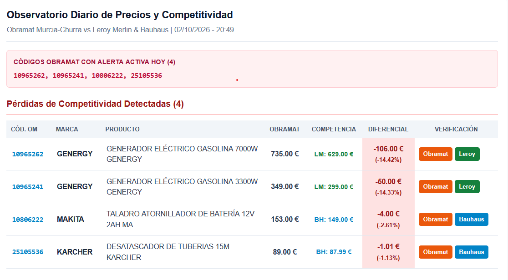

# price-comparison-agent
Autonomous retail price comparator & surveillance engine using Python, Google Gemini API, Playwright CDP and Local Chrome.

Comparador automatizado de precios de maquinaria y herramientas profesionales entre Obramat (Murcia-Churra), Leroy Merlin (Murcia Sur) y Bauhaus (Alfafar). Diseñado con una política estricta de cero datos fósiles (zero-fallback), evasión de WAF perimetral y generación de alertas ejecutivas para Jefatura de Sector.

---

## 🤖 Integración del Agente de IA (Google Gemini API)

El sistema integra un agente impulsado por el modelo Google Gemini (vía `GEMINI_API_KEY`), reservado para tareas de alto nivel cognitivo dentro del pipeline:

* **Homologación semántica de referencias:** Análisis técnico profundo entre fichas de competidores para confirmar equivalencias (potencia, motorización, litraje de calderines o depósitos, accesorios y tecnología AVR). Clasifica los emparejamientos en `HOMOLOGADO_DIRECTO`, `HOMOLOGADO_CON_DIFERENCIAS` o `NO_HOMOLOGADO` (descarte inmediato).
* **Mapeo de series y marcas complejas:** Resolución de asimetrías de nomenclatura comercial entre canales (ej. serie Turbo en distribución profesional frente a serie Limited en gran superficie).
* **Análisis de competitividad y síntesis ejecutiva:** Detección de brechas de precio reales frente al suelo del almacén y redacción contextual de las alertas para el correo diario.

> **Delimitación técnica:**  
> La IA opera estrictamente como motor de análisis, homologación y estructuración. La recolección de precios en vivo se delega en el subsistema de navegación asistida para garantizar geolocalización real de tienda física y evasión de bloqueos.

---

## 🛡️ Retos Técnicos y Evolución de la Extracción de Datos

### 1. Intentos de Automatización y Limitaciones Detectadas

* **Fase 1 (Peticiones HTTP directas / `curl_cffi`):** Bloqueo con HTTP 403 Forbidden por cortafuegos perimetrales (DataDome / Cloudflare).
* **Fase 2 (CI/CD en GitHub Actions):** Bloqueo inmediato de IP al originarse en subredes de centros de datos (Azure) identificadas por los WAFs comerciales.
* **Fase 3 (Inyección manual de cookies):** Inviable debido a la caducidad rápida de las cookies de sesión vinculadas a la huella criptográfica del almacén.
* **Fase 4 (Playwright Headless / Stealth aislado):** Bloqueo por telemetría avanzada de navegador (`navigator.webdriver` y variables internas de automatización).

---

### 2. Arquitectura de Producción: Extracción Asistida por CDP

El sistema opera en producción mediante conexión local al protocolo CDP (Chrome DevTools Protocol):

* **Instancia nativa de Chrome:** Se ejecuta con `--remote-debugging-port=9222` sobre un perfil de usuario real. Hereda huellas reales de hardware, extensiones, pantalla nativa y cookies locales de almacén (Murcia-Churra / Murcia Sur / Alfafar).
* **Conexión Playwright (`connect_over_cdp`):** El script se acopla a la ventana ya abierta en `localhost:9222` sin inyectar binarios automatizados, logrando una tasa de bloqueo perimetral nula.
* **Flujo de datos:**
  1. `catalogo_vigilancia.json` actúa como matriz pura de homologación y URLs.
  2. `tracker_diario.py` extrae los precios vivos navegando vía CDP.
  3. `historico_precios.csv` almacena el histórico en modo append-only.
  4. `notificador_email.py` compila y envía el informe HTML diario ante alertas de competitividad.

---

## ⚙️ Reglas de Negocio e Integridad de Datos

### Política de "Cero Fósiles" (Zero-Fallback)
* Desacoplamiento total: `catalogo_vigilancia.json` actúa como una matriz de mapeo técnico y URLs, libre de campos de precios estáticos.
* Si un producto competidor se encuentra descatalogado, fuera de stock o falla la extracción, el sistema registra estrictamente `None` / `---` y cataloga la incidencia como `COMPETENCIA SIN STOCK` o `SIN DATOS SUFICIENTES`. Jamás se arrastran precios de días anteriores.
* `historico_precios.csv` es un registro acumulativo append-only que refleja únicamente extracciones vivas verificadas.

### Blindaje contra Precios Tachados (ADEO: Obramat / Leroy Merlin)
* Para evitar capturar el precio previo tachado en productos con descuento (ej. capturar 349 € en vez de la oferta vigente de 299 €), el motor analiza la caja de compra (`[data-cerberus="ZONE_OFFRE"]`, `.pdp-stage`).
* Se descartan elementos asociados a etiquetas `del`, `s` o selectores CSS de precios antiguos (`crossed`, `strike`, `old`, `ANCIEN`), recorriendo el bloque en orden inverso para garantizar la lectura del precio final real sin desbordar hacia carruseles inferiores.

### Extracción Multiformato en Tailwind (Bauhaus)
* Manejo de tipografía fragmentada: Captura de decimales en superíndices mediante `span.whitespace-nowrap:has(sup)`.
* Tratamiento de precios sin céntimos: Normalización por expresiones regulares de terminaciones con guion (ej. `149,-` -> `149.00 €`).

### Filtro de Banda de Precio y Principio de Precio Suelo (Roadmap)
* Banda de coherencia (+-35%): Descarte automático de candidatos durante el descubrimiento si la desviación de precio respecto a la referencia excede el 35%, separando gamas de bricolaje de herramientas industriales.
* Precio Suelo: Cuando existen múltiples opciones en la misma familia, las alertas de competitividad se calculan contra la referencia de menor importe (precio suelo del segmento), evitando falsas alarmas sobre modelos profesionales de gama alta.

---

## 🚀 Puesta en Marcha Rápida

1. Abrir Chrome en modo depuración remota:
   `chrome.exe --remote-debugging-port=9222 --user-data-dir="C:\ChromeData_Tracking"`
2. Ejecutar el rastreador diario:
   `python tracker_diario.py`
3. Generación de informe:
   Al detectar pérdidas de competitividad frente a la competencia local, el script invoca automáticamente `notificador_email.py` enviando el informe maquetado a Jefatura de Sector.
<<<<<<< HEAD
=======
   
>>>>>>> d95e479 (docs: agregar captura de ejemplo del informe por email)
